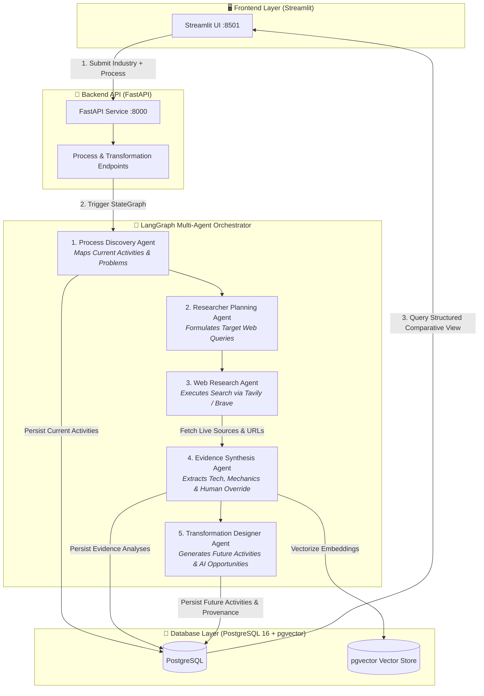
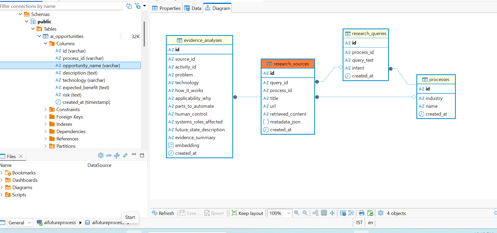
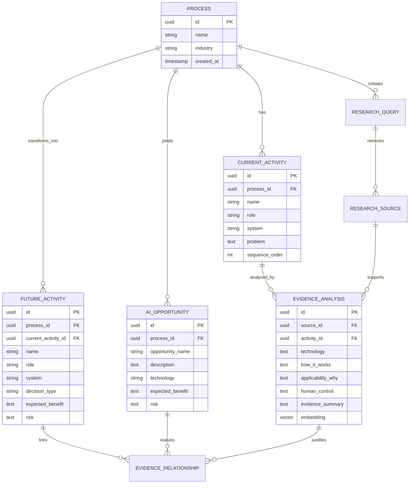
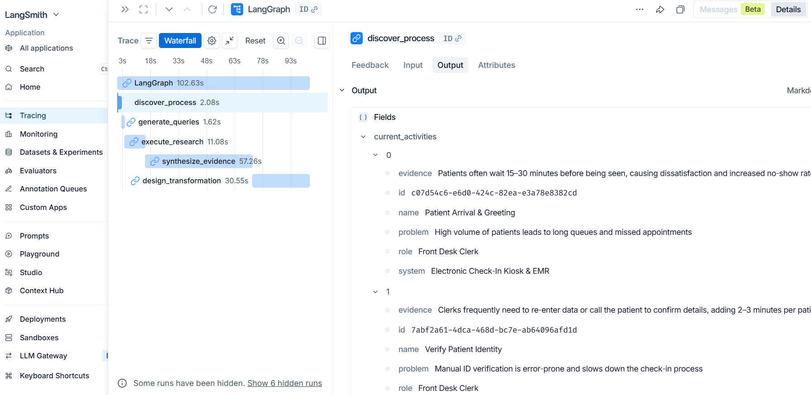
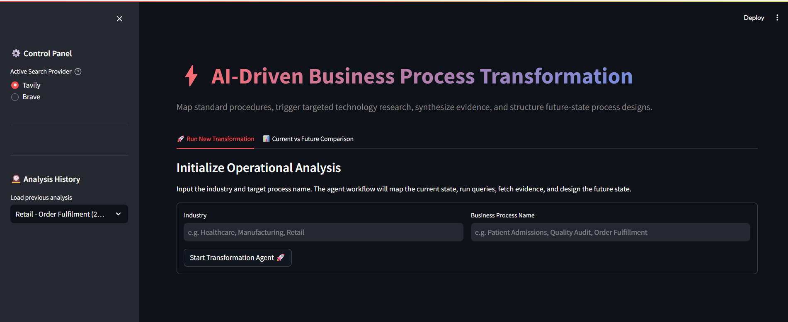
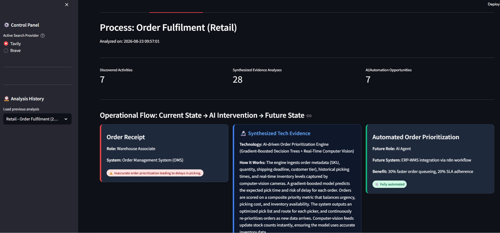
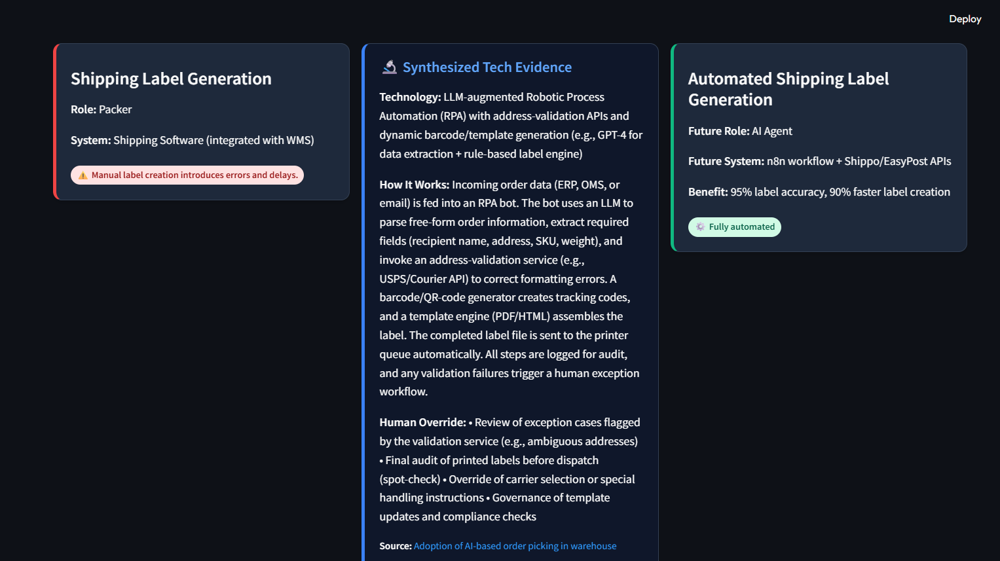
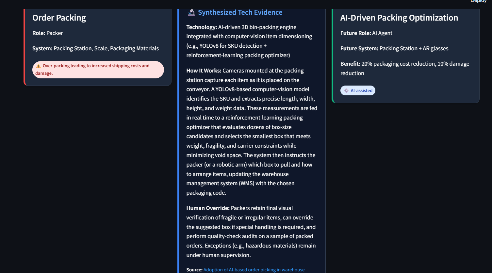
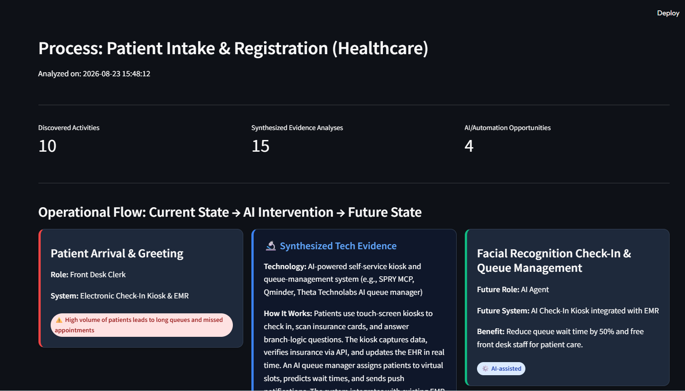
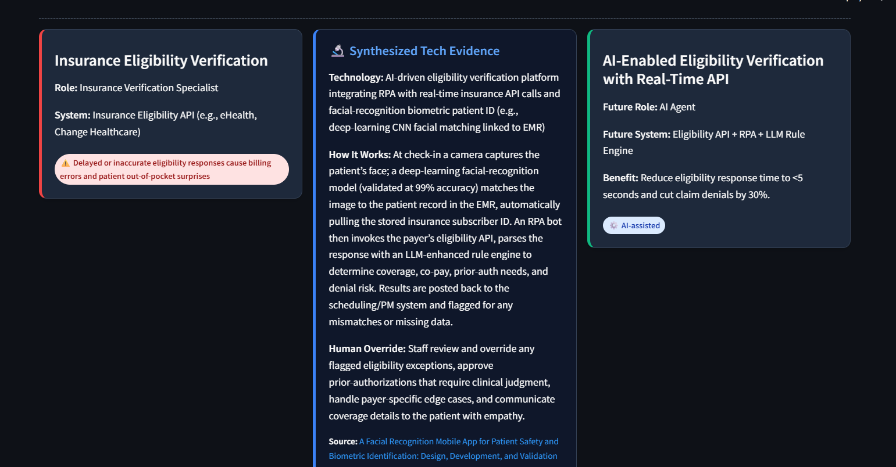

# ⚡ AI Future Process Designer

> **Autonomous Multi-Agent Architecture for Enterprise Process Discovery, Live Technology Research, Evidence Synthesis, and Future-State Re-engineering.**

[](https://vimeo.com/1220614994?share=copy&fl=sv&fe=ci)
&nbsp;&nbsp;
---

## 📖 Table of Contents
- [1. Summary & Reason for building](#1-summary--reason-for-building)
- [2. The Problem It Solves](#2-the-problem-it-solves)
- [3. Core Philosophy & Key Differentiators](#3-core-philosophy--key-differentiators)
- [4. System Architecture & Workflow](#4-system-architecture--workflow)
- [5. Database Schema & Relational Data Model](#5-database-schema--relational-data-model)
- [6. Technology Stack](#6-technology-stack)
- [7. Agent Workflow & Observability (LangSmith & LangGraph)](#7-agent-workflow--observability-langsmith--langgraph)
- [8. Getting Started & Setup Guide](#8-getting-started--setup-guide)
  - [Prerequisites](#prerequisites)
  - [Environment Variables Setup](#environment-variables-setup)
  - [Running via Docker Compose (Recommended)](#running-via-docker-compose-recommended)
  - [Running Locally (Without Docker)](#running-locally-without-docker)
- [9. User Interface & Feature Walkthrough](#9-user-interface--feature-walkthrough)
  - [Dashboard Overview](#dashboard-overview)
  - [Retail Store Operations Transformation](#retail-store-operations-transformation)
  - [Healthcare Patient Intake Transformation](#healthcare-patient-intake-transformation)
- [10. Testing & Verification](#10-testing--verification)

---

## 1. Summary & Reason for building

Modern organizations spend millions on management consulting firms to audit operational bottlenecks and map digital transformation roadmaps. Traditionally, this produces static PowerPoint slide decks full of abstract AI buzzwords that fail to bridge the gap between high-level promises and concrete operational reality.

**AI Future Process Designer** is an autonomous, agentic system designed to ingest any business process, systematically map its current-state activities, conduct real-time web research across peer-reviewed technologies and production case studies, synthesize verifiable evidence, and design an end-to-end, machine-readable future state.

---

## 2. The Problem It Solves

| Traditional Transformation Consulting | AI Future Process Designer |
| :--- | :--- |
| **Static & Manual**: Weeks of manual interviews and static diagrams. | **Dynamic & Autonomous**: Maps full operational flows in seconds. |
| **Hallucinated / Generic AI Hype**: Proposes vague "use machine learning" without architectural specifics. | **Evidence-Grounded**: Gathers real research sources (Tavily/Brave) with live URLs and exact algorithmic models. |
| **Unstructured Paragraphs**: Unstructured text reports that cannot be programmatically tracked or audited. | **Fully Structured Relational Model**: Stores every activity, decision type, role, and system in PostgreSQL. |
| **No Provenance**: Disconnect between the future state and why that technology was chosen. | **Complete Lineage**: Every future activity links directly to an AI Opportunity and its backing Evidence Analysis. |

---

## 3. Core Philosophy & Key Differentiators

1. **Structured Granularity Over Hallucinated Paragraphs**:
   The engine does not output high-level narratives. It decomposes workflows into atomic steps: `Role`, `System`, `Problem`, `Technology Used`, `How It Works`, `Human vs. AI Decision Model`, and `Expected Benefit`.
2. **Strict Provenance & Evidence Verification**:
   Outputs are backed by live search queries executed against real-world tech documentation, whitepapers, and operational case studies with active source hyperlinks.
3. **100% Free & Open-Source Compatible**:
   Runs completely on free-tier APIs (Groq `openai/gpt-oss-20b`, Tavily) or 100% offline using local LLMs (Ollama `qwen2.5:7b`).
4. **Persistent Multi-Tenant Relational Storage**:
   Backed by PostgreSQL 16 with `pgvector` embeddings (`sentence-transformers/all-MiniLM-L6-v2`) for semantic search and auditability.

---

## 4. System Architecture & Workflow



---

## 5. Database Schema & Relational Data Model

Every transformation is mapped into a normalized relational model stored in PostgreSQL:

### 📊 Production PostgreSQL Schema (DBeaver ER Diagram)




---

## 6. Technology Stack

| Layer | Component | Technology | Rationale |
| :--- | :--- | :--- | :--- |
| **Orchestration** | Multi-Agent Graph | **LangGraph** (`StateGraph`) | Explicit cyclic graph execution, state persistence, and modular node boundaries. |
| **Backend** | REST API & DB ORM | **FastAPI**, **SQLAlchemy**, **Uvicorn** | High-performance asynchronous API endpoints with auto-generated OpenAPI docs. |
| **Frontend** | Interactive UI | **Streamlit** | Responsive, live-updating three-column operational comparison dashboard. |
| **Database** | Relational & Vector Store | **PostgreSQL 16** with **`pgvector`** | Complete relational integrity combined with native vector embeddings. |
| **Embeddings** | Semantic Representation | **Sentence-Transformers** (`all-MiniLM-L6-v2`) | Lightweight CPU-optimized embeddings for evidence similarity & search. |
| **LLM Inference** | High-Speed Reasoning | **Groq API** (`openai/gpt-oss-20b`), **Ollama**, or **OpenAI** | Sub-second inference latency with robust JSON output capabilities. |
| **Search Providers**| Live Evidence Retrieval | **Tavily Search API** / **Brave Search API** | Real-time web index retrieval with verified domains, titles, and snippets. |
| **Observability** | Agent Tracing | **LangSmith** | Full trace visibility into agent reasoning, token metrics, and tool execution. |
| **Containerization**| Production Runtime | **Docker** & **Docker Compose** | One-command orchestration across DB, backend API, and frontend web server. |

---

## 7. Agent Workflow & Observability (LangSmith & LangGraph)

The transformation pipeline is composed of 5 specialized agents located in [`backend/app/agents/nodes.py`](file:///c:/Users/Lenovo/OneDrive/Desktop/AIPossibilities/backend/app/agents/nodes.py):

### 🔍 Full Observability & Execution Trace (LangSmith)


1. **Process Discovery Agent (`discover_process_node`)**:
   - Ingests the industry and process name.
   - If pre-seeded in the database (e.g., *Retail Order Fulfilment*), loads the verified baseline.
   - If a new process is entered, uses LLM synthesis guided by [`discovery.md`](file:///c:/Users/Lenovo/OneDrive/Desktop/AIPossibilities/backend/app/prompts/discovery.md) to generate discrete activities, human roles, legacy software systems, and operational bottlenecks.
2. **Researcher Planning Agent (`plan_research_node`)**:
   - Formulates targeted search queries designed to find modern automation solutions for the identified bottlenecks using [`researcher.md`](file:///c:/Users/Lenovo/OneDrive/Desktop/AIPossibilities/backend/app/prompts/researcher.md).
3. **Web Research Agent (`execute_research_node`)**:
   - Executes search queries through the active provider (Tavily or Brave).
   - Sanitizes and stores URL metadata, titles, and extracted content snippets in PostgreSQL.
4. **Evidence Synthesis Agent (`synthesize_evidence_node`)**:
   - Implements throttled concurrency (`asyncio.Semaphore(2)`) to process activities in parallel.
   - Synthesizes exact technology descriptions, algorithmic mechanics, and human override safeguards using [`synthesis.md`](file:///c:/Users/Lenovo/OneDrive/Desktop/AIPossibilities/backend/app/prompts/synthesis.md).
   - Generates and stores 384-dimensional semantic embeddings for pgvector search.
5. **Transformation Designer Agent (`design_transformation_node`)**:
   - Translates current activities and synthesized evidence into concrete future-state steps using [`transformation.md`](file:///c:/Users/Lenovo/OneDrive/Desktop/AIPossibilities/backend/app/prompts/transformation.md).
   - Assigns explicit decision modes: `AI-assisted`, `Fully Automated`, `Human-in-the-loop`, or `Human Decision`.
   - Records explicit foreign-key links in `EvidenceRelationship` to establish complete provenance.

---

## 8. Getting Started & Setup Guide

### Prerequisites
- [Docker](https://docs.docker.com/get-docker/) & [Docker Compose](https://docs.docker.com/compose/) installed on your system.
- *(Optional for non-docker run)*: Python 3.11+ and PostgreSQL with `pgvector`.

---

### Running via Docker Compose (Recommended)

1. **Build and start all services**:
   ```bash
   docker compose up --build -d
   ```
2. **Verify running containers**:
   ```bash
   docker compose ps
   ```
   *You should see `transform_db`, `transform_backend`, and `transform_frontend` in healthy/running state.*

3. **Access the Applications**:
   - **Frontend UI (Streamlit)**: [http://localhost:8501](http://localhost:8501)
   - **Backend API Docs (Swagger UI)**: [http://localhost:8000/docs](http://localhost:8000/docs)
   - **API Health Endpoint**: [http://localhost:8000/api/health](http://localhost:8000/api/health)

---

### Running Locally (Without Docker)

1. **Install Backend Dependencies**:
   ```bash
   cd backend
   python -m venv venv
   source venv/bin/activate  # Or venv\Scripts\activate on Windows
   pip install -r requirements.txt
   ```
2. **Start Backend Server**:
   ```bash
   uvicorn backend.app.main:app --host 0.0.0.0 --port 8000 --reload
   ```
3. **Install Frontend Dependencies & Run Streamlit**:
   ```bash
   cd frontend
   pip install -r requirements.txt
   streamlit run app.py --server.port 8501
   ```

---

## 9. User Interface & Feature Walkthrough

### Dashboard Overview
The transformation dashboard provides search provider selection, previous run history, and process submission controls.



---

### Retail Store Operations Transformation
Transformation demonstration for the **Order Fulfilment** retail process, showing how manual picking, packing, and dispatch are re-engineered into an AI-augmented pipeline.

#### 1. Order Receipt & Dynamic Prioritization


#### 2. Shipping Label Automation (RPA + LLMs)


#### 3. 3D Bin-Packing & Computer Vision Packaging


---

### Healthcare Patient Intake Transformation
Transformation demonstration for **Patient Intake & Registration (Healthcare)**, re-engineering check-in queues and insurance eligibility verification into automated workflows.

#### 1. Patient Arrival & AI Queue Management


#### 2. AI-Enabled Insurance Eligibility Verification


---

## 10. Testing & Verification

Run automated test suites to verify end-to-end connectivity, agent state transitions, and database persistence:

```bash
# Run backend workflow tests inside docker
docker compose exec backend pytest tests/test_flow.py -v
```

To verify database seeding and table initialization:
```bash
docker compose exec db psql -U postgres -d aifutureprocess -c "\dt"
```

---

**This project was developed as part of the Modus Enterprise AI Build Challenge.**
